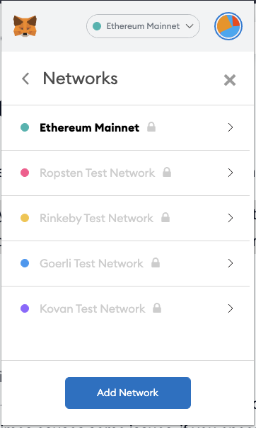

# ✅ Add Cronos to Metamask

> Click [here](https://cronos.crypto.org/docs/getting-started/metamask.html) for a direct link to Cronos.org article on adding Cronos to Metamask.
>
> We will sum it up for you though, follow below!

## Connecting to the Cronos Mainnet Beta 

First of all, we need to connect the MetaMask with the Cronos chain network:

Hit the "my account" button in the top right corner, under **"Settings"**, select **"Networks"**

In the **"Networks"** page, click "Add Network":

Insert the network name. For example, "Cronos" and put

* https://evm-cronos.crypto.org for **New RPC URL**, and
* 25 for **Chain ID**,
* CRO for the S**ymbol**, and
* https://cronos.crypto.org/explorer/ for the **Block explorer URL** as below:

