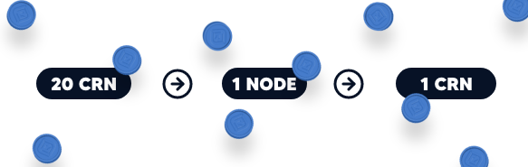

# 📃 Whitepaper

### Introduction 

Currently, we are experiencing an era of money transfer that has never been seen. The age of cryptocurrencies and decentralized economies is booming and Defi has forced the hands of many to adapt to a rapidly changing financial world. A financial world that is likely to be run by blockchain technology.

### What is this DeFi stuff? 

What we offer our investors is simple: Create consistent passive income. Our goal is to create a DeFi as a service, one platform that does all the work and heavy lifting. After all, we strive to be an investment vehicle that you can trust your money in. (And make some money doing so)

### What Cronodes brings to our investors 

What we offer our investors is simple: Create consistent passive income. Our goal is to create a DeFi as a service, one platform that does all the work and heavy lifting. After all, we strive to be an investment vehicle that you can trust your money in. (And make some money doing so)

### Through Cronodes: 

* You don’t need to research hundreds of protocols to make an investment. (We do still suggest to DYOR) Your DeFi business begins and ends with Cronodes. We efficiently combine returns from protocol-owned liquidity with returns from DeFi protocols across numerous chains.
* No need to buy expensive software to do swapping, bonding, staking, or bridging for you. You can simply invest with a cheap laptop and an internet connection. Some cases even with your phone! This allows you to free up your most valuable asset, your time.
* Reduced fees! Cronodes works in a way where we pool resources together, charges are then distributed according to everybody's contribution, this results in a relatively smaller fee per head. Additionally, each transaction on a chain requires a gas fee. The native coin to the Cronos chain is $CRO, which is currently at $0.54. Each transaction takes a fraction of your $CRO token, adding up to a very small transaction fee after all is said in done. This is a benefit to all users.
* Simple and easy. Nobody likes to struggle or interact with complicated websites, especially in the crypto space which is already confusing as is. Therefore, we designed a simple website that is easy to navigate. Your task is simple: buy CRONODE ($CRN) with $CRO on [Cronaswap](https://app.cronaswap.org/swap), connect your wallet to our website, buy a Cronode, and celebrate. When the time comes, you simply claim your daily rewards.
* Less Risk, more reward: Cronodes is a community-driven, value-adding protocol that is both open and transparent, with no hierarchy or exclusivity. We verify all protocols before we invest to minimize risks to the barest minimum, what’s even more interesting is we allow our community to decide from a list of carefully curated and verified protocols

### Behind the scenes 

Cronodes brings a high yield potential combined with a trustworthy methodology. It allocates rewards and yield holders efficiently by combining returns from protocol-owned liquidity and returns from DeFi protocols across many chains.

We use our trading strategy to identify several DeFi projects. Because this is a community project, we do not make these investment decisions rather the selected projects are made open in the community for a vote before we initiate the investment protocol. We watch for bull and bear market trends so that we can profit from any market situation. This way, there are no gaps in our earnings. This cycle is repeated, providing you with an everlasting source of passive income.

### How to create a Cronode 

You buy 20 Cronode ($CRN) tokens to create 1 Node and you get 1 Cronode ($CRN) tokens as daily accumulated rewards - for life! Be reminded, this value is an estimation, it may change in the future to sustain the project.

1. Buy $CRO
2. Buy Cronodes ($CRN)
3. Connect your wallet to our website
4. Create a Cronode with 20 Cronode ($CRN) tokens
5. Enjoy!

### **Where do my 20 Cronode tokens go?**  

This is what happens when a Cronode is created: 14 Cronode ($CRN) are sent to the rewards pool, 2 Cronode ($CRN) is put to the liquidity pool as 50% Cronode ($CRN) and 50% CRO, and 4 Cronode ($CRN) are transferred to the marketing team wallet to support the protocol's stability and token growth. Rewards are distributed every 24 hours, and you may claim your rewards in Cronode ($CRN) tokens from the console.

Please bear in mind that just like the rewards value, the distribution frequency is an estimate and may change in the future to ensure project sustainability. Also, once a node is created, it cannot be shut down. but aside from your rewards, investors will also enjoy the increase in Cronodes token's intrinsic value. Call it double rewards.

### Claiming 

There is a 10% claim tax when claiming rewards. This tax is sent back into the distrobution pool for further rewards.

### Tokenomics 

Network: Cronos

Name: Cronodes

Symbol: $CRN

Contract Address: 0x8174BaC1453c3AC7CaED909c20ceaDeb5E1CDA00

Burn Token: 0x000000000000000000000000000000000000dead

Total Supply: 20,456,743\
\
Circulation Supply: 1,000,000

**Thanks for viewing our whitepaper, we hope you enjoy your time in the Cronodes community!**
